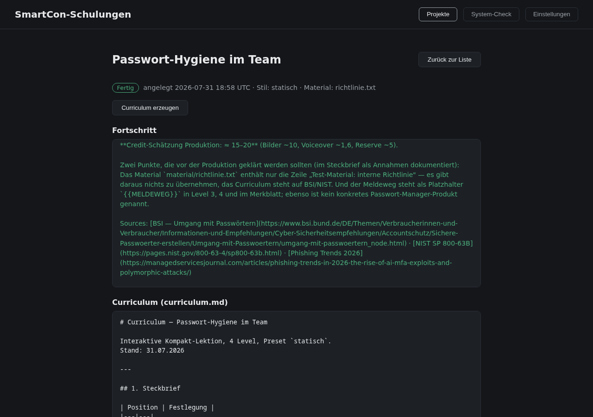
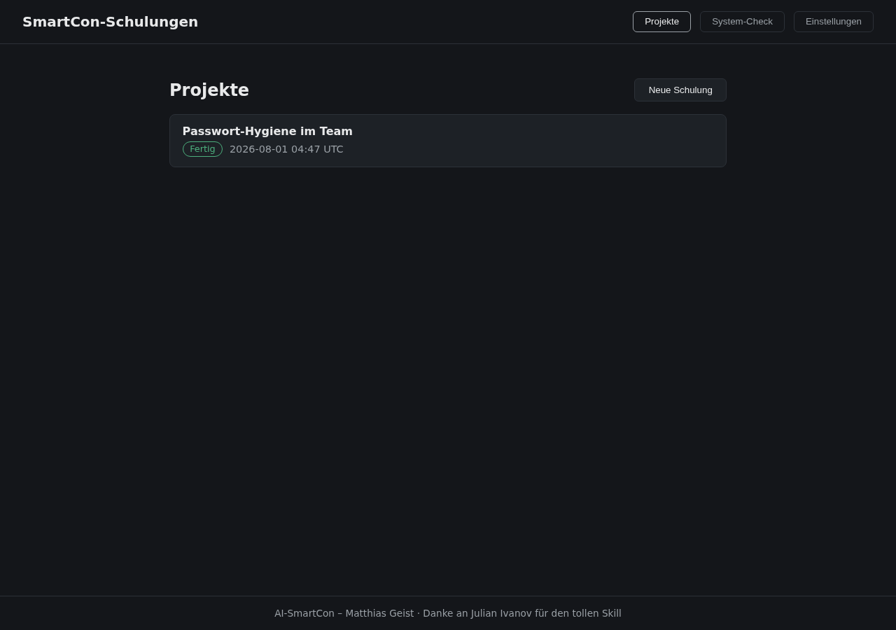
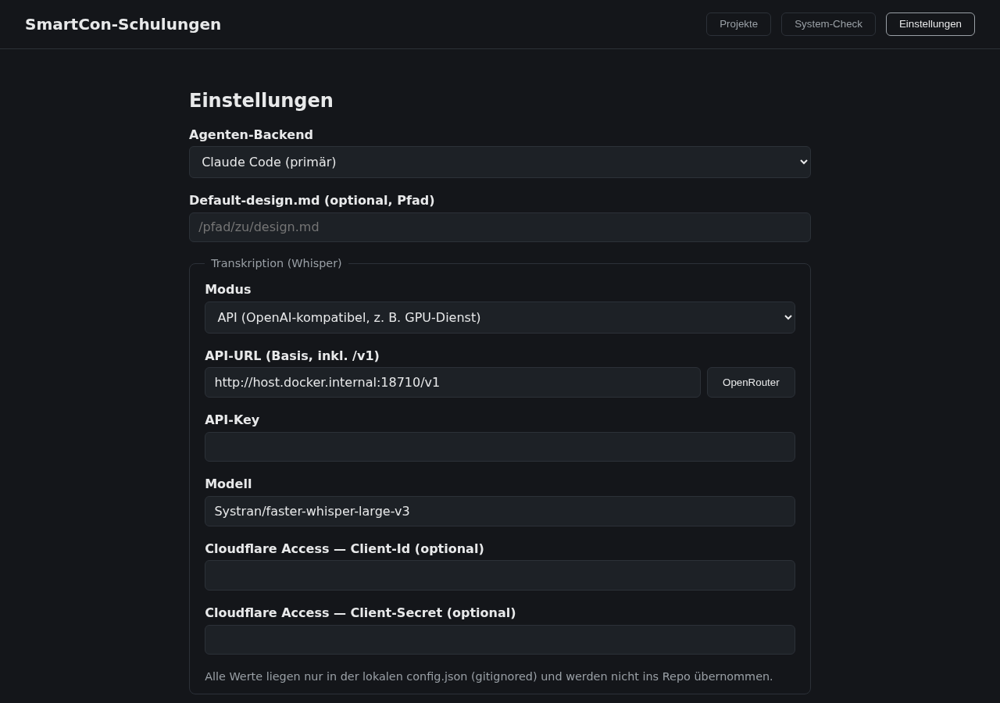

# SmartCon-Schulungen

Interaktive Schulungen per Formular-App erstellen: Eine lokale Web-Oberfläche führt
Schritt für Schritt vom Briefing über das Curriculum (mit Freigabe-Gate) bis zur
fertigen, offline lauffähigen HTML-Lerneinheit — mit KI-Videos, Erklär-Animationen,
Voiceover, Gamification und Quiz. Die Denkarbeit übernimmt ein KI-Agent im Hintergrund
(Claude Code oder Kimi, umschaltbar), die App steuert die Phasen.

Auf Wunsch komplett **kostenlos**: Der Schalter „KI-Medien" erzeugt dieselbe
interaktive Lerneinheit ohne Higgsfield — schrittgesteuerte HTML-Szenen statt
Beat-Choreografie, null Credits.

Gebaut von **AI-SmartCon – Matthias Geist**.
Danke an **Julian Ivanov** für den tollen Skill.

## Funktionsumfang

- **Projekt-Wizard**: Briefing-Formular (Thema, Lernziele, Zielgruppe, Sprache, Dauer),
  Stil-Presets als Karten, Upload eigener `design.md` (Kunden-CI) und Quellmaterial
- **Stil-System**: fünf Presets (`cinematic`, `comic`, `corporate`, `statisch`,
  `kostenlos`) bestimmen die Machart und damit den Higgsfield-Einsatz
- **Eigenes Design (optional)**: eine mitgegebene `design.md` setzt Farben,
  Schriften und Tonalität — kombinierbar mit jedem Preset. Eine `cinematic`-
  Schulung bleibt cinematic, nur eben in der CI des Kunden
- **KI-Medien-Schalter (Ja/Nein)**: mit oder ohne Higgsfield produzieren, frei
  kombinierbar mit jedem Preset. „Nein" = 0 Credits, keine Higgsfield-Abhängigkeit
- **Curriculum-Phase (kostenlos)**: Der Agent recherchiert und schreibt das komplette
  Curriculum (Lernziele, Lehrtexte, Voiceover-/Sprechertexte, Interaktionen,
  Kosten-Schätzung) als Markdown — im Browser editierbar, Änderungswünsche per
  Kommentar-Box direkt an den Agenten (Session-Resume)
- **Freigabe-Gate**: Medium je Level per Dropdown umschalten (FILM/ANIMATION/BILD),
  Kosten-Dashboard mit Posten, Summe und Guthaben-Abgleich — der Agent misst jede
  geplante Generierung vorab mit `higgsfield generate cost` nach
- **Produktion**: Live-Fortschritt (SSE), Verbrauchs-Zähler, Preflight vor jeder
  kostenpflichtigen Aktion, Abbruch statt „so weit es reicht"
- **History**: fertige Schulungen bleiben gelistet; Ergebnis im Browser ansehen oder
  herunterladen; Nachbearbeiten per Phasen-Rücksprung; Löschen mit Rückfrage
- **System-Check**: prüft alle Abhängigkeiten live — jede Kachel ist anklickbar und
  zeigt eine Schritt-für-Schritt-Installationsanleitung
- **Auch vom Handy bedienbar**: die Oberfläche ist auf schmale Displays ausgelegt,
  die Projektliste aktualisiert sich während eines Laufs von selbst — man kann die
  Seite verlassen und später wieder reinschauen, der Agent läuft im Server weiter

## So läuft eine Schulung durch

1. **Briefing** — Formular ausfüllen, Preset wählen, KI-Medien Ja/Nein
2. **Curriculum erzeugen** — der Agent schreibt `curriculum.md` (Minuten, 0 Credits)
3. **Prüfen** — Editor, Kommentar-Box, Medium-Dropdowns, Kosten-Dashboard
4. **Freigeben** — erst jetzt darf produziert werden
5. **Produktion** — Voiceover, Bilder, Videos, HTML-Bau, Browser-Test (~15–60 Min)
6. **Ergebnis** — eine einzige offline lauffähige HTML-Datei zum Ansehen/Teilen

## Status

Produktiv im Eigenbetrieb, frühe öffentliche Version. Das verbindliche
Pflichtenheft steht in [SPEC.md](SPEC.md), der Technik-Überblick in
[TECH_STACK.md](TECH_STACK.md).

## Screenshots

| Projekte & History | Projekt-Detail mit Curriculum |
|---|---|
|  |  |

| System-Check mit Installationsanleitungen | Einstellungen |
|---|---|
|  |  |

## Voraussetzungen

- **Docker** (empfohlener Weg) — das Image enthält alles Weitere
- Ohne Docker: Python 3.11+, dazu je nach Nutzung:
  - `claude`-CLI (Claude Code) und/oder `kimi`-CLI, jeweils angemeldet
  - Higgsfield-CLI (`npm i -g @higgsfield/cli`, dann `higgsfield auth login` und
    `higgsfield workspace set <id>`) — **nicht nötig** bei KI-Medien = Nein
  - `ffmpeg`, optional lokales `whisper` oder ein OpenAI-kompatibler
    Transkriptionsdienst, optional Node 22+ (HyperFrames-Renders)

## Start

### Mit Docker (empfohlen)

Die Anmeldungen der CLIs kommen nicht ins Image, sondern werden aus dem
Home-Verzeichnis gemountet (Pfade in `docker-compose.yml` anpassen):

```sh
docker compose build
docker compose up -d
```

Danach http://localhost:8710 im Browser öffnen (bzw. http://\<host-ip\>:8710 aus dem
LAN — abschaltbar in den Einstellungen).

Dienste auf dem Host (z. B. ein SSH-Tunnel zum Whisper-Dienst) sind im Container
über `host.docker.internal` erreichbar — in den Einstellungen also
`http://host.docker.internal:<port>/v1` eintragen.

### Ohne Docker (Entwicklung)

```sh
python3 -m venv .venv
.venv/bin/pip install -r requirements.txt
.venv/bin/python -m app.main
```

Der System-Check in der App zeigt, was fehlt (Kacheln anklicken für Anleitungen).

## Konfiguration

Alle Einstellungen im UI (Tab „Einstellungen"), gespeichert in `config.json`
(**gitignored** — dort liegen auch API-Keys und Cloudflare-Tokens):

| Einstellung | Bedeutung |
|---|---|
| Agenten-Backend | `claude` (primär) oder `kimi` (Fallback) |
| Default-design.md | Pfad zu einer eigenen CI-Datei |
| Transkription | lokal (Whisper-Befehl) oder API (OpenAI-kompatibel: URL, Key, Modell, optional Cloudflare-Access-Token) |
| LAN erreichbar | **Default aus** = nur localhost; an = `0.0.0.0` (kein Login — jedes Gerät im Netz darf). Nur in vertrauten Netzen einschalten |
| Port | Default 8710 |

## Datenablage

Pro Schulung ein Ordner `projects/<slug>/` (gitignored): `brief.json`,
`status.json` (Phase, Agenten-Sessions, Guthaben), `curriculum.md`, `kosten.json`,
`events.jsonl` (Fortschritts-Protokoll), `material/`, `medien/`, fertige HTML.
Löschen geht direkt in der App: im Projekt ganz unten „Schulung löschen", nach
einer Rückfrage verschwindet der komplette Ordner. Während ein Agent arbeitet,
ist das gesperrt.

## Teilnehmer-Portal

Fertige Schulungen lassen sich an Teilnehmer ausgeben. Der Weg:

1. **Teilnehmer anlegen** (Reiter „Teilnehmer"): E-Mail, Name, Firma.
2. **Schulung zuordnen** — nur Schulungen, für die eine Prüfung erzeugt wurde.
3. **Freischalten**: erzeugt das Passwort und öffnet den Zugang für 30 Tage.
   Das Passwort wird **einmal** angezeigt und ist danach nicht mehr abrufbar.
4. Der Teilnehmer meldet sich unter `/portal` an, arbeitet die Lerneinheit
   durch und legt die Abschlussprüfung ab — drei Versuche.
5. Bei Bestehen gibt es den Nachweis als druckbare Seite.

Die Prüfung wird **auf dem Server** ausgewertet; die richtigen Antworten
verlassen ihn nicht. Die Daten liegen in `data/kurse.db` (gitignored) und
gehören ins Backup:

    sqlite3 data/kurse.db ".backup data/kurse-$(date +%F).db"

## Architektur in Kürze

```
Browser (Vanilla JS Wizard)
   │  HTTP + SSE
FastAPI (lokal/Docker)
   │  Subprozess + stream-json
claude -p  /  kimi -p   ← schulung-Skill (im Repo: skill/schulung/)
   │  CLI-Aufrufe
higgsfield · ffmpeg · Whisper-API · (HyperFrames)
   │
projects/<slug>/  — status.json, curriculum.md, Medien, fertige HTML
```

Die App besitzt die State-Machine (Briefing → Curriculum → Gate → Produktion →
fertig), der Agent arbeitet pro Phase mit klaren Arbeitsaufträgen zu. Details:
[TECH_STACK.md](TECH_STACK.md) und [SPEC.md](SPEC.md).
